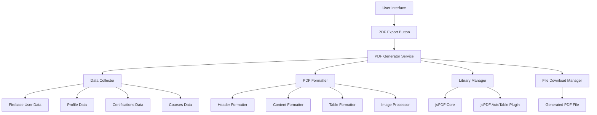

# Design Document: PDF Export Functionality

## Overview

The PDF export functionality will enhance the CertiHub application by providing users with a professional way to export their complete profile data, certifications, courses, and academic records as a formatted PDF document. The solution addresses the current issue where the jspdf-autotable plugin is not properly imported, causing "rt.auto.table is not a function" errors.

The design focuses on creating a robust, user-friendly PDF generation system that integrates seamlessly with the existing React application architecture and Firebase data structure.

## Architecture

### High-Level Architecture



### Component Integration

The PDF export functionality will be integrated into the existing App.jsx component structure:

- **Trigger**: The existing "Export PDF" button in the sidebar navigation
- **Data Source**: Existing React state (user, profile, certs, courses)
- **Processing**: Enhanced generatePDF function with proper library imports
- **Output**: Browser download of formatted PDF file

## Components and Interfaces

### 1. PDF Generator Service

**Purpose**: Main orchestrator for PDF generation process

**Interface**:
```typescript
interface PDFGeneratorService {
  generatePDF(userData: UserData): Promise<void>
  validateLibraries(): boolean
  handleError(error: Error): void
}

interface UserData {
  user: FirebaseUser
  profile: UserProfile | null
  certifications: Certification[]
  courses: Course[]
}
```

**Responsibilities**:
- Coordinate the entire PDF generation process
- Validate library availability before processing
- Handle errors and provide user feedback
- Manage the download process

### 2. Data Collector

**Purpose**: Gather and prepare all user data for PDF generation

**Interface**:
```typescript
interface DataCollector {
  collectUserData(): UserData
  validateData(data: UserData): ValidationResult
  prepareProfileData(profile: UserProfile): FormattedProfile
  prepareCertifications(certs: Certification[]): FormattedCertification[]
  prepareCourses(courses: Course[]): FormattedCourse[]
}
```

**Responsibilities**:
- Extract data from React state
- Validate data completeness
- Transform data into PDF-ready format
- Handle missing or null data gracefully

### 3. PDF Formatter

**Purpose**: Handle all PDF layout, styling, and content organization

**Interface**:
```typescript
interface PDFFormatter {
  createDocument(): jsPDF
  addHeader(doc: jsPDF, userData: UserData): number
  addProfileSection(doc: jsPDF, profile: FormattedProfile, yPos: number): number
  addCertificationsSection(doc: jsPDF, certs: FormattedCertification[], yPos: number): number
  addCoursesSection(doc: jsPDF, courses: FormattedCourse[], yPos: number): number
  addFooter(doc: jsPDF): void
  checkPageBreak(doc: jsPDF, yPos: number, requiredSpace: number): number
}
```

**Responsibilities**:
- Create and configure jsPDF document
- Apply consistent styling and formatting
- Manage page layout and breaks
- Handle content positioning

### 4. Library Manager

**Purpose**: Ensure proper initialization and availability of PDF libraries

**Interface**:
```typescript
interface LibraryManager {
  initializeLibraries(): boolean
  validateJsPDF(): boolean
  validateAutoTable(): boolean
  getLibraryVersions(): LibraryVersions
}
```

**Responsibilities**:
- Import and initialize jsPDF and plugins
- Validate library availability
- Provide fallback mechanisms
- Report library status

## Data Models

### User Data Structure

```typescript
interface UserData {
  user: {
    uid: string
    email: string
    displayName?: string
    photoURL?: string
  }
  profile: {
    fullName?: string
    college?: string
    major?: string
    degree?: string
    gradYear?: string
    gpa?: string
    bio?: string
    github?: string
    linkedin?: string
    avatar?: string
    semesters?: Semester[]
  } | null
  certifications: Certification[]
  courses: Course[]
}

interface Certification {
  id: string
  title: string
  issuer: string
  month?: string
  year?: string
  skills?: string
  link?: string
  certificateImage?: string
}

interface Course {
  id: string
  title: string
  platform: string
  month?: string
  year?: string
  skills?: string
  link?: string
  certificateImage?: string
}

interface Semester {
  sgpa: string
  credits: string
}
```

### PDF Layout Configuration

```typescript
interface PDFConfig {
  pageWidth: number
  pageHeight: number
  margins: {
    top: number
    bottom: number
    left: number
    right: number
  }
  fonts: {
    header: { size: number, style: string }
    subheader: { size: number, style: string }
    body: { size: number, style: string }
    caption: { size: number, style: string }
  }
  colors: {
    primary: string
    secondary: string
    text: string
    background: string
  }
  spacing: {
    sectionGap: number
    itemGap: number
    lineHeight: number
  }
}
```

## Correctness Properties

*A property is a characteristic or behavior that should hold true across all valid executions of a system—essentially, a formal statement about what the system should do. Properties serve as the bridge between human-readable specifications and machine-verifiable correctness guarantees.*

### Property 1: PDF Generation Workflow Integrity
*For any* user interaction with the Export PDF button, the system should complete the full workflow: initiate generation, show loading feedback, process data, generate PDF, provide download, and show success/error feedback appropriately.
**Validates: Requirements 1.1, 1.2, 1.3, 1.4, 1.5**

### Property 2: Complete Content Inclusion
*For any* user data set (profile, certifications, courses, academic records), the generated PDF should include all available data sections with proper headers, content, and formatting when data exists.
**Validates: Requirements 2.1, 2.2, 2.3, 2.4, 2.5, 2.6, 2.7**

### Property 3: Document Structure and Formatting Consistency
*For any* generated PDF, the document should have consistent section organization, proper table formatting for structured data, appropriate page breaks, clickable links, and complete footer information on all pages.
**Validates: Requirements 3.2, 3.3, 3.4, 3.5, 3.6, 3.7**

### Property 4: Library Integration and Functionality
*For any* PDF generation attempt, the system should successfully use jsPDF core functionality and jspdf-autotable plugin without throwing "is not a function" errors, while gracefully handling image embedding and invalid image data.
**Validates: Requirements 4.1, 4.2, 4.3, 4.4, 4.5**

### Property 5: Filename Generation and Metadata
*For any* user profile data, the system should generate valid filenames following the pattern "{FullName}_Certihub_{Date}.pdf" (with "Portfolio" fallback), include proper ISO date formatting, embed PDF metadata, and ensure cross-platform filename compatibility.
**Validates: Requirements 5.1, 5.2, 5.3, 5.4, 5.5**

### Property 6: Error Handling and Resilience
*For any* error condition (corrupted images, missing data, library failures), the system should handle errors gracefully by using placeholders for missing data, logging detailed error information, displaying user-friendly messages, and validating library availability before processing.
**Validates: Requirements 6.1, 6.2, 6.3, 6.4, 6.5**

### Property 7: Progress Feedback During Processing
*For any* PDF generation operation, especially longer ones, the system should provide appropriate progress feedback to keep users informed of the processing status.
**Validates: Requirements 7.3**

## Error Handling

### Library Loading Errors
- **Detection**: Validate jsPDF and jspdf-autotable availability before use
- **Response**: Display clear error message and prevent PDF generation
- **Recovery**: Provide instructions for refreshing the page or checking browser compatibility

### Data Processing Errors
- **Missing Profile Data**: Use "N/A" placeholders for missing fields
- **Invalid Image Data**: Skip corrupted images and log warnings
- **Empty Data Sets**: Generate PDF with available data and appropriate "no data" messages

### PDF Generation Errors
- **Memory Issues**: Implement chunked processing for large datasets
- **Browser Compatibility**: Provide fallback mechanisms for older browsers
- **File System Errors**: Handle download failures with retry mechanisms

### User Experience Errors
- **Network Issues**: Provide offline-capable PDF generation
- **Long Processing Times**: Implement progress indicators and timeout handling
- **Multiple Concurrent Requests**: Prevent duplicate PDF generation attempts

## Testing Strategy

### Dual Testing Approach

The testing strategy employs both unit tests and property-based tests to ensure comprehensive coverage:

**Unit Tests** focus on:
- Specific examples of PDF generation with known data sets
- Edge cases like empty data, missing images, and error conditions
- Integration points between components
- Library initialization and validation

**Property-Based Tests** focus on:
- Universal properties that hold across all input variations
- Comprehensive input coverage through randomization
- Validation of correctness properties defined in this document

### Property-Based Testing Configuration

- **Library**: Use fast-check for JavaScript property-based testing
- **Iterations**: Minimum 100 iterations per property test
- **Test Tags**: Each property test must reference its design document property
- **Tag Format**: **Feature: pdf-export-functionality, Property {number}: {property_text}**

### Test Implementation Requirements

Each correctness property must be implemented by a single property-based test:

1. **Property 1 Test**: Generate random user interactions and verify complete workflow execution
2. **Property 2 Test**: Generate random user data sets and verify all content inclusion
3. **Property 3 Test**: Generate random PDFs and verify structural consistency
4. **Property 4 Test**: Test library integration with various data scenarios
5. **Property 5 Test**: Generate random user profiles and verify filename/metadata generation
6. **Property 6 Test**: Inject random error conditions and verify graceful handling
7. **Property 7 Test**: Test progress feedback with various processing scenarios

### Unit Test Coverage

Unit tests complement property tests by covering:
- Specific regression scenarios (the original "rt.auto.table is not a function" error)
- Known edge cases from user feedback
- Integration with React component lifecycle
- Firebase data structure compatibility
- Browser download functionality

### Test Data Management

- **Mock Data**: Create comprehensive mock data sets for testing
- **Image Handling**: Use base64 test images and corrupted data for error testing
- **User Scenarios**: Test with various user profile completeness levels
- **Performance Testing**: Separate performance tests for large data sets (not part of unit/property tests)

## Implementation Notes

### Library Import Strategy
The current issue stems from improper jspdf-autotable import. The solution requires:
```javascript
import jsPDF from 'jspdf'
import 'jspdf-autotable' // This import adds autoTable to jsPDF prototype
```

### React Integration
- Maintain existing component structure in App.jsx
- Enhance existing generatePDF function rather than replacing it
- Preserve existing UI feedback mechanisms (success messages, loading states)

### Performance Considerations
- Implement lazy loading for large image sets
- Use Web Workers for heavy processing if needed
- Implement progressive PDF generation for large data sets

### Browser Compatibility
- Test across major browsers (Chrome, Firefox, Safari, Edge)
- Provide fallbacks for older browser versions
- Handle mobile browser limitations